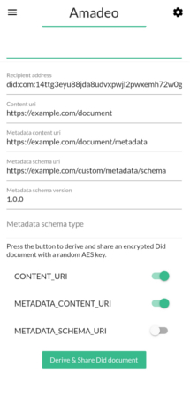
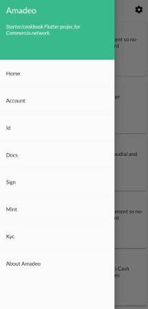

# Amadeo

[](https://travis-ci.com/commercionetwork/Amadeo)
[](https://opensource.org/licenses/MIT)
[](https://pub.dev/packages/bloc)

Amadeo is a starter/cookbook Flutter project to let anyone create on [Commercio.network](https://commercio.network/) a:

* Auth app
* eID app
* eDelivery app
* eSignature app
* Token App
* KYC app
  
How? Commercio provides a set of ready-made easy-to-modifiy visual elements to build any solution to any document problem.  

* CommercioAccount
* CommercioID
* CommercioDocs
* CommercioSign
* CommercioMint
* CommercioMembership

Amadeo in not a production ready app. You need to fork it and create your own vision...

## Screenshots

[](docs/images/screenshots/Amadeo_App_screen_1.jpg)
[](docs/images/screenshots/Amadeo_App_screen_3.jpg)
[](docs/images/screenshots/Amadeo_App_screen_5.jpg)

## About

The name Amadeo is to celebrate and remember the life of [Amadeo Peter Giannini](https://en.wikipedia.org/wiki/Amadeo_Giannini).

## Getting Started

Clone the project

```bash
git clone git@github.com:commercionetwork/Amadeo.git --depth=1
cd Amadeo
```

Compile and run the app:

```bash
flutter run  # Use --release flag to build in release mode
```

### The app is also avaiable as an experimental web and linux application

* To enable web support for Flutter:

  ```bash
  flutter channel beta
  flutter upgrade
  flutter config --enable-web
  ```

  * Debug with:

    ```bash
    flutter run -d web-server # Use --release flag to build in release mode
    ```

  * Compile and deploy (here we use `python`):

    ```bash
    flutter build web
    cd build/web/
    python -m SimpleHTTPServer 8000  # Navigate to http://localhost:8000/
    ```
  
  See also: [Build and release a web app](https://flutter.dev/docs/deployment/web).

* To enable linux support for Flutter:

  ```bash
  sudo apt-get install clang cmake ninja-build pkg-config libgtk-3-dev
  flutter channel master
  flutter upgrade
  flutter config --enable-linux-desktop
  ```

  * Debug with:

    ```bash
    flutter run -d linux  # Use --release flag to build in release mode
    ```

  * Compile with:

    ```bash
    flutter build linux
    ```
  
  See also: [Desktop support for Flutter](https://flutter.dev/desktop), [Build and release a Linux app](https://flutter.dev/docs/deployment/linux).

## Licence

```plain
MIT License

Copyright (c) 2020 Commercio.network

Permission is hereby granted, free of charge, to any person obtaining a copy
of this software and associated documentation files (the "Software"), to deal
in the Software without restriction, including without limitation the rights
to use, copy, modify, merge, publish, distribute, sublicense, and/or sell
copies of the Software, and to permit persons to whom the Software is
furnished to do so, subject to the following conditions:

The above copyright notice and this permission notice shall be included in all
copies or substantial portions of the Software.

THE SOFTWARE IS PROVIDED "AS IS", WITHOUT WARRANTY OF ANY KIND, EXPRESS OR
IMPLIED, INCLUDING BUT NOT LIMITED TO THE WARRANTIES OF MERCHANTABILITY,
FITNESS FOR A PARTICULAR PURPOSE AND NONINFRINGEMENT. IN NO EVENT SHALL THE
AUTHORS OR COPYRIGHT HOLDERS BE LIABLE FOR ANY CLAIM, DAMAGES OR OTHER
LIABILITY, WHETHER IN AN ACTION OF CONTRACT, TORT OR OTHERWISE, ARISING FROM,
OUT OF OR IN CONNECTION WITH THE SOFTWARE OR THE USE OR OTHER DEALINGS IN THE
SOFTWARE.
```
